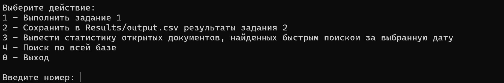
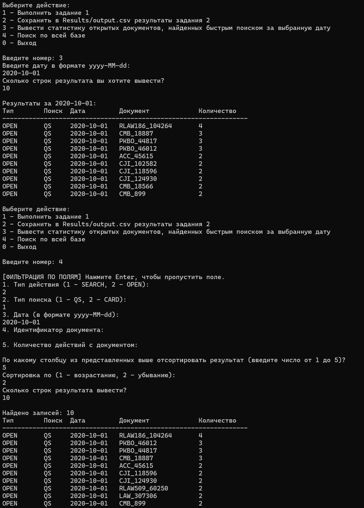

# Тестовое задание от Направления разработки систем управления большими данными

## Оглавление
- [Описание задачи](#описание-задачи)
- [Описание данных](#описание-данных)
- [Описание технологического стека](#описание-технологического-стека)
- [Установка и запуск проекта](#установка-и-запуск-проекта)
- [Работа в приложении](#работа-в-приложении)
- [Техническая часть](#техническая-часть)
- [Ответы](#ответы-на-задания)

## Описание задачи
Вам предстоит установить Apache Spark локально на своей домашней машине, научиться запускать Spark-задачи на языке Scala, разработать и запустить Spark-задачу для вычисления требуемых показателей на предоставленных данных.

## Описание данных
Данные представляют из себя учебную модель пользовательских сессий системы КонсультантПлюс. Под сессией понимается последовательность действий пользователя в системе КонсультантПлюс между открытием и закрытием системы. В сессиях обязательно присутствуют события начала и конца сессии – SESSION_START и SESSION_END. События быстрого поиска – QS и карточки поиска – CARD_SEARCH_START. Быстрый поиск – это поиск документов через поисковую строку. Поиск документов через быстрый поиск характеризуется текстом запроса и списком найденных документов. Карточка поиска – это поиск документов по различным параметрам. Поиск документов через карточку поиска характеризуется списком заданных параметров (каждый параметр описывается идентификатором и значением этого параметра в конкретном поиске) и списком найденных документов. Так же в сессиях могут присутствовать события открытия документа DOC_OPEN. Открытие документа должно обязательно соответствовать какому-то поиску. Каждому документу соответствует идентификатор вида <БАЗА>_<НОМЕР ДОКУМЕНТА>, например: PGU_13, ACC_45614, LAW_221940 и т.п.

## Описание технологического стека
| Компонент            | Версия       | Описание                                  |
|----------------------|--------------|-------------------------------------------|
| JDK                  | 11           | Основная платформа исполнения             |
| Apache Spark         | 3.3.0        | Обработка данных и агрегация              |
| Scala                | 2.12.18      | Язык разработки                           |
| Apache Maven         | 3.9.9        | Сборка проекта и управление зависимостями |
| IntelliJ IDEA CE     | 2025.1.1     | Среда разработки                          |
| log4j                | 2.17.2       | Логирование                               |
| SLF4J                | 1.7.32       | Интерфейс логирования                     |
| exec-maven-plugin    | 3.1.0        | Запуск Scala-кода через Maven             |
| scala-maven-plugin   | 4.5.6        | Компиляция Scala-кода                     |

## Установка и запуск проекта
1. Установите проект с GitHub:
- создайте папку под проект на своем ПК;
- инициализируйте локальный репозиторий в этой папке (здесь и далее предоставлены команды для командной стоки):
<pre> git init </pre>
- привяжите локальный репозиторий к этому глобальному репозиторию (можно получить при нажатии большой зеленой кнопки с надписью Code вверху страницы):
<pre> git remote add origin <ссылка_на_этот_git> </pre>
- перенесите проект на свой ПК:
<pre> git pull origin main </pre>
2. Установите все необходимые компоненты из технического стека выше.
3. !ВАЖНО! Обратите внимание на папку Sessions. В нее необходимо добавить файлы с данными без дополнительных вложенных директорий, то есть при открытии папки Sessions должны сразу показываться все файлы для анализа. Возможно, легче будет перетащить папку с файлами в директорию с папкой Sessions, затем удалить последнюю и переименовать Вашу папку в Sessions. P.S. Данных нет в git, так как я не знаю, разрешено ли их выкладывать в открытый доступ.
4. Перейдите в рабочу папку проекта:
<pre> cd .\DataEngineerKplus\ </pre>
5. Скомпилируйте приложение:
<pre> mvn compile </pre>
6. Запустите приложение:
<pre> mvn exec:java "--define=exec.mainClass=org.example.MainApp" </pre>

Перенос проекта, компиляция и чтение файлов после запуска приложения могут занять до нескольких минут.

## Работа в приложении
После запуска приложения, оно начнет чтение файлов, находящихся в папке Sessions. После прочтения всех файлов, появится меню следующего вида:

1. При выборе пункта 1, выведется количество раз, когда в карточке производили поиск документа с идентификатором ACC_45616, то есть сколько раз документ с идентификатором ACC_45616 выпадал в списке найденных документов при событии карточки поиска.

2. При выборе пункта 2, в csv файл сохраняется количество открытий каждого документа, найденного через быстрый поиск за каждый день. Был выбран формат таблицы следующего вида:

| actionType      | searchType       | date         | documentId      | count |
|-----------------|------------------|--------------|-----------------|-------|
| OPEN            | QS               | 2020-01-01   | RLAW123-32367   | 1     |
| ...             | ...              | ...          | ...             | ...   |
| OPEN            | QS               | 2020-12-26   | LAW-330075      | 1     |

Таким образом, по последнему столбцу, можно понять, сколько раз открывали данный документ в данную дату. Таблица отсортирована по датам, что позволяет в ней легче ориентироваться. 

3. При выборе пункта 3, есть возможность выбрать в дату, после чего появится информация обо всех документах, которые открывались пользователями в этот день. Формат выбран аналогичным формату из предыдущего пункта (но уже не в файле, а в терминале).

4. В пункте 4 был реализован поиск по всей таблице. Этого задания не было выдано, но я решил создать возможность более гибкого поиска, вдохновившись языком логического программирования Prolog. В данном пункте пользователь может выбрать содержание каждого из пяти столбцов, то есть 
  - тип действия - документ найден или открыт;
  - тип поиска - быстрый поиск или поиск по карточкам поиска;
  - дата - дата взаимодействия с документом в формате yyyy-MM-dd;
  - идентификатор документа;
  - количество действий с документом.

При этом, каждую из строк можно оставить пустой, тогда поиск будет производиться только по заполненным строкам. Далее, после выбора, по какому столбцу сортировать данные, пользователю выводится таблица уже знакомого вида (из пункта 2), в которой столбцы, которые пользователь заполнил, гарантированно совпадают с тем, что пользователь туда написал. Таким образом, можно находить специфические наборы данных, интересные определенным пользователям.

К примеру, если ввести запросить тип действия "документ найден", тип поиска "поиск по карточкам", дату пропустить, идентификатор документа "ACC_45616" и количество действий пропустить, то мы получим таблицу, сложив количества действий с документом из которой, мы получим ответ на первое задание.

А если запросить тип действия "документ открыт", тип поиска "быстрый", дату выбрать интересующую, идентификатор документа и количество действий пропустить, то получим таблицу, аналогичную таблице из пункта 3.

5. При вводе 0, программа завершается.

## Техническая часть
- Модель данных
После анализа технического задания, была создана одна таблица, содержащая только необходимые данные для решения поставленных задач. Данная таблица для обоих заданий является избыточной, однако было принято решение не создавать отдельную таблицу под каждое задание, чтобы в итоге иметь одну полноценную таблицу, по которой можно будет производить поиск без join. Таблица имеет столбцы вида

| actionType      | searchType       | date         | documentId      | count       |
|-----------------|------------------|--------------|-----------------|-------------|
| String          | String           | String       | String          | Integer     |

Здесь:
  - actionType - тип действия (документ найден или открыт);
  - searchType - тип поиска (быстрый поиск или поиск по карточкам поиска);
  - date - дата (дата взаимодействия с документом в формате yyyy-MM-dd);
  - documentId - идентификатор документа;
  - count - количество действий с документом.

То, что actionType и searchType не Boolean позволит нам без больших проблем добавлять новые типы действий и типы поиска.

- Парсинг файлов
Было обнаружено, что в строке, начинающейся на QS есть дата запроса, а следующая строка начинается с идентификатора поиска. В случае поиска карточками, в строке, начинающейся на CARD_SEARCH_START есть дата, а строка, идущая после CARD_SEARCH_END, начинается с идентификатора поиска. 

Таким образом, было принято решение читать каждый файл дважды - в первый раз, находятся все идентификаторы поиска и записываются в массив, где им записывается в соответствие тип поиска и дата. Во время второго прохода, мы ищем строки, начинающиеся с идентификаторов поиска - после них будет идти список файлов, найденных в ходе этого поиска. Также, мы ищем строки, начинающиеся с кодового слова DOC_OPEN. Из этих строк мы находим идентификатор поиска, берем дату для открытия файла (она в приоритете относительно даты поиска, так как, в теории, поиск мог произойти без нескольких минут полночь, а открытие файла, соответсвтвующее этому поиску, уже заполночь, то есть технически на следующий день), и сам идентификатор документа. 

После прочтения всех файлов, мы находим все строки с совпадающими первыми четырьмя столбцами. Это будут одинаковые действия сделанные в один день с одним документом, следственно, необходимо оставить только одну строку, содержащую в последнем столбце сумму всех count этих одинаковых строк.

В итоге, мы получаем таблицу всех действий после определенного поиска со всеми договорами и содержащие количество этих действий в указанную дату.

## Ответы на задания
1. Количество раз, когда в карточке производили поиск документа с идентификатором ACC_45616: 460.
2. Количество открытий каждого документа, найденного через быстрый поиск за каждый день сохранено в формате из пункта 2 [работы в приложении](#работа-в-приложении) в файле [output.csv](DataEngineerKplus/Results/output.csv).